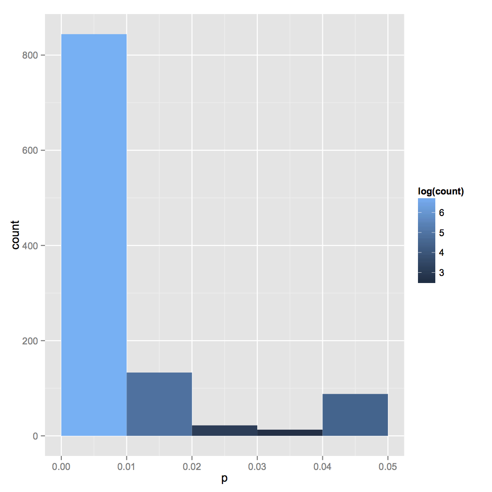

# PCurveR

These are, or as it may, will be, functions to analyse and plot distributions of p values in R.

The initial plan is to simply duplicate the methods from the http://www.p-curve.com/ website. As time goes by, I hope to add some additional things. 

Any comments or ideas, raise an issue on the repo (top right if you're on the GitHub page right now).

## Very short usage example

```
# here's our data - a list of p values.
# note that they all have to be < 0.05
# and they all have to come from tests in which the 
# distribution of p values under the null is uniform


# here are some p values you might get from a strong effect size
p <- rexp(1000, 200)
p <- p[p<0.05]

# let's add some p-hacking and/or publication bias
h <- -1 * rexp(100, 200) + 0.05
h <- h[h>0.00]

p <- c(p, h)

pcurve.plot(p)
```

Your plot should look a bit like this:



```
# Now we can do some tests

# 1. Can we reject a uniform distribution?
pcurve.binomial.test(p)

# answer: Yes. Very right skewed. This uses a midpoint of 0.025, tests for left/right balance in the plot

# 3. We can do Fisher's test to test for skew as well.
pcurve.fisher.test(p)

```
